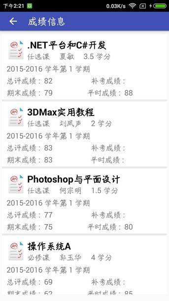
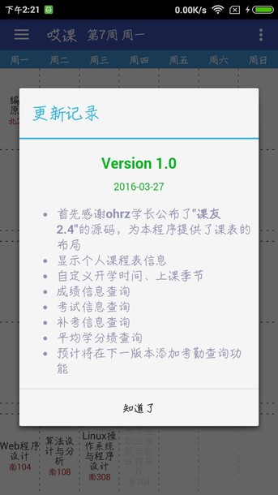

# AhutCourse_mobile

## 大学生个人课表系统 - “哎课”（Android）

**描述**

* 显示个人课程表信息
* 自定义开学时间、上课季节
* 成绩信息查询
* 考试信息查询
* 补考信息查询
* 平均学分绩查询

**技术实现**

* 使用`http`进行模拟登陆python-webservice接口
* 自定义 `HttpUtil` 类实现 `GET`、`POST`方法获取`json`数据
* 使用`SQLite`数据库保存个人信息以及课程信息

## 图片展示

### 课表显示

### 成绩查询

### 考试查询

### 关于

